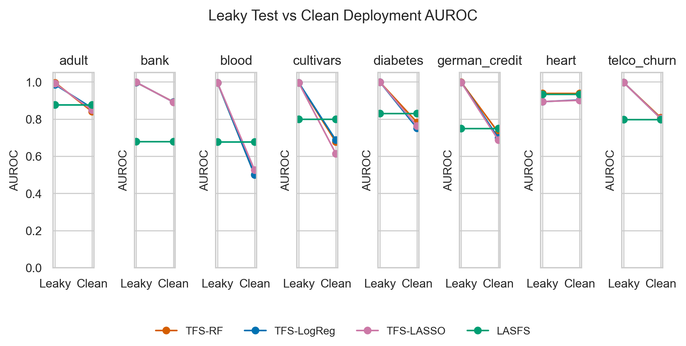

# LASFS

LASFS is a leakage-aware feature selection framework for tabular prediction.
It combines statistical feature importance with LLM-based semantic assessment
of leakage risk, prediction-time availability, and scoring uncertainty.

The current benchmark compares:

- `TFS-RF`: Random Forest feature-importance selection.
- `TFS-LogReg`: L2 Logistic Regression coefficient-based feature selection.
- `TFS-LASSO`: L1 Logistic Regression coefficient-based sparse feature selection.
- `LASFS`: Random Forest scores re-ranked with semantic leakage penalties.

The repository is organized so that experiments start from fixed injected CSV
snapshots. Dataset download and preprocessing are not part of the experiment
run path.

## Repository Layout

```text
backend/                 FastAPI CSV upload demo
frontend/                Vite + React demo UI
experiment/
  configs/               Dataset and experiment YAML files
  injected/              Fixed experiment inputs with 3 injected leakage features
  processed/             Processed CSV snapshots
  raw/                   Raw source snapshots
  src/lasfs/             Core LASFS package
  experiments/           Experiment entry points
  scripts/               Result checks and paper-artifact generation
paper_artifacts/
  tables/                Latest generated paper-ready CSV tables
  figures/               Latest generated PNG figures
```

## Data Flow

The fixed data preparation contract is:

```text
experiment/raw -> experiment/processed -> experiment/injected
```

Each experimental dataset in `experiment/injected` contains exactly three
human-constructed leakage features and a companion metadata JSON file. Main and
ablation experiments call `lasfs.data.load_dataset`, which loads only the
`experiment/injected` snapshots. They do not download data and do not inject new
features at runtime.

`experiment/experiments/prepare_data.py` remains available only for rebuilding
the prepared snapshots when source data changes.

## Datasets

The current suite contains eight tabular datasets:

```text
adult
bank
blood
cultivars
diabetes
german_credit
heart
telco_churn
```

`synthetic` is kept for smoke tests and is excluded from paper artifacts by
default.

## Reproduce Experiments

From `experiment/`:

```bash
python -m pip install -e .
python -m pytest -q
```

Run the main experiments directly from `experiment/injected`:

```bash
for dataset in adult bank blood cultivars diabetes german_credit heart telco_churn; do
  python experiments/run_main.py --config configs/${dataset}.yaml --output-dir results
done
```

Run the ablation study:

```bash
for dataset in adult bank blood cultivars diabetes german_credit heart telco_churn; do
  python experiments/run_ablation.py --config configs/${dataset}.yaml --output-dir results
done
```

Generate paper tables and figures:

```bash
python scripts/check_results.py --results-dir results
python scripts/check_results.py --results-dir results --output ../paper_artifacts/tables/integrity_report.csv
python scripts/make_paper_artifacts.py --results-dir results --tables-dir ../paper_artifacts/tables --figures-dir ../paper_artifacts/figures
```

Use `--mock-llm` on the experiment commands for offline debugging. The paper
run uses the configured DeepSeek API key and caches semantic scores under
`experiment/results/llm_cache`.

## Latest Run

The latest run uses five seeds per dataset, eight datasets, and four main
methods (`TFS-RF`, `TFS-LogReg`, `TFS-LASSO`, `LASFS`). Integrity checks passed
after regenerating `experiment/results`.

Key outputs:

- `experiment/results/tables/*_main_results.csv`
- `experiment/results/tables/*_ablation_results.csv`
- `experiment/results/selected_features/*.csv`
- `paper_artifacts/tables/table_main_results_mean_std.csv`
- `paper_artifacts/tables/table_lasfs_delta_vs_baselines.csv`
- `paper_artifacts/tables/table_ablation_formatted.csv`
- `paper_artifacts/figures/fig_deployment_drop.png`
- `paper_artifacts/figures/fig_injected_leakage_recall.png`
- `paper_artifacts/figures/fig_clean_auroc.png`

Summary from the latest generated tables:



| Dataset       | LASFS Clean AUROC | LASFS Clean F1 | RF Leaks | LogReg Leaks | LASSO Leaks | LASFS Leaks |
|---------------|------------------:|---------------:|---------:|-------------:|------------:|------------:|
| adult         |             0.877 |          0.643 |      3.0 |          2.0 |         2.6 |         0.0 |
| bank          |             0.679 |          0.260 |      3.0 |          3.0 |         3.0 |         0.0 |
| blood         |             0.677 |          0.359 |      3.0 |          3.0 |         2.8 |         0.0 |
| cultivars     |             0.800 |          0.688 |      3.0 |          3.0 |         3.0 |         0.0 |
| diabetes      |             0.830 |          0.661 |      3.0 |          3.0 |         3.0 |         0.0 |
| german_credit |             0.750 |          0.827 |      3.0 |          3.0 |         3.0 |         0.0 |
| heart         |             0.934 |          0.891 |      0.0 |          1.8 |         1.4 |         0.0 |
| telco_churn   |             0.798 |          0.526 |      3.0 |          3.0 |         3.0 |         0.0 |

The strongest supported empirical claim is leakage robustness: LASFS avoids
the injected leakage features across the benchmark while maintaining competitive
clean-deployment performance. The result should not be read as universal
predictive superiority on every dataset.
